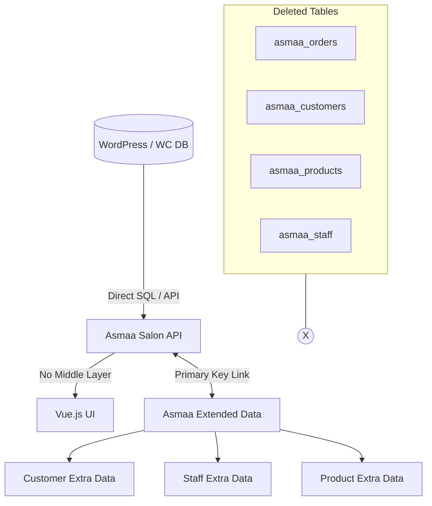

# الخطة الشاملة للتحول لمصدر الحقيقة الموحد وتنظيف النظام

بناءً على التوجيهات الأخيرة، سنقوم بتنفيذ عملية تحول جذري تتضمن الانتقال الكامل للبيانات الأصلية، إزالة أزرار المزامنة، وحذف الجداول القديمة نهائياً.

## 1. إزالة واجهات المزامنة (Frontend Cleanup)

بما أن النظام سيعمل مباشرة على الجداول الأصلية، يجب إزالة أي إشارة لعملية "المزامنة" لمنع الارتباك.

- **الطلبات**: حذف زر "مزامنة" ومنطق المزامنة من [`assets/src/views/Orders/Index.vue`](assets/src/views/Orders/Index.vue).
- **الإعدادات**: تبسيط [`assets/src/views/Settings/WooCommerce.vue`](assets/src/views/Settings/WooCommerce.vue) لإلغاء خيارات المزامنة اليدوية والتلقائية القديمة.

## 2. تحديث المكونات البرمجية (Backend Logic Update)

تعديل كافة الـ Controllers لتعمل مع الجداول الأصلية + جداول البيانات الإضافية (`extended_data`).

- **التقارير**: تحديث [`includes/API/Controllers/Reports_Controller.php`](includes/API/Controllers/Reports_Controller.php) ليعتمد كلياً على `wc_get_orders`.
- **نقاط البيع**: تعديل [`includes/API/Controllers/POS_Controller.php`](includes/API/Controllers/POS_Controller.php) لإنشاء طلبات WooCommerce مباشرة.
- **الموظفون والعملاء**: ضمان ربط كافة العمليات (عمولات، نقاط ولاء) بالمعرفات الأصلية (`wp_user_id` / `wc_customer_id`).

## 3. تنظيف قاعدة البيانات (Database Cleanup)

هذه الخطوة هي الأخطر وتتطلب التأكد من أن كافة المراجع في الكود قد تم تحديثها.

- **الإجراء**: إنشاء migration نهائي لحذف الجداول التالية:
    - `asmaa_orders`
    - `asmaa_order_items`
    - `asmaa_customers`
    - `asmaa_products`
    - `asmaa_staff`
    - `asmaa_wc_sync_log` (لم يعد هناك حاجة لسجلات المزامنة)

## 4. مراجعة خدمة التكامل (WooCommerce_Integration_Service)

- تعطيل كافة وظائف المزامنة (Sync) داخل [`includes/Services/WooCommerce_Integration_Service.php`](includes/Services/WooCommerce_Integration_Service.php) وتحويلها إلى خدمة مساعدة فقط لجلب البيانات الإضافية أو معالجة أحداث WooCommerce.

## المخطط المعماري النهائي:

## التزامات الخطة:

- **تحذير**: حذف الجداول سيؤدي لفقدان البيانات الموجودة فيها فقط وغير الموجودة في WooCommerce. يجب التأكد من اكتمال المزامنة النهائية قبل الحذف (أو اعتبار أن WooCommerce هو المرجع الحالي).
- توحيد كافة الاستعلامات لتستخدم `LEFT JOIN` مع جداول `extended_data` لضمان عدم فقدان مميزات الصالون الخاصة.