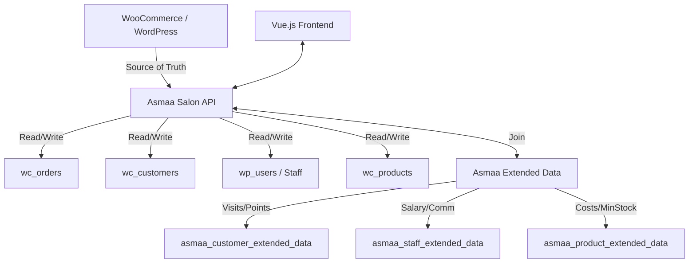

# خطة الفحص والتصحيح والتحسين (Check, Debug, and Fix Plan)

بناءً على خطة `@.cursor/plans/comprehensive-woocommerce-sync_078d641d.plan.md` والمشاكل التي تم رصدها في الكود الحالي، سنقوم بسلسلة من الإجراءات لضمان عمل النظام بالكامل وفق مبدأ "مصدر الحقيقة الموحد" (Source of Truth).

## 1. فحص وتصحيح التقارير (Reports_Controller)

التقارير لا تزال تعتمد بشكل كبير على جداول `asmaa_orders` و `asmaa_customers` القديمة، مما يؤدي لنتائج غير دقيقة.

- **الإجراء**: تحديث [`includes/API/Controllers/Reports_Controller.php`](includes/API/Controllers/Reports_Controller.php) لاستخدام `wc_get_orders` و `wc_get_products` في حساب الإحصائيات (الإيرادات، المنتجات الأكثر مبيعاً، إلخ).
- **التفاصيل**: استبدال استعلامات SQL المباشرة على الجداول القديمة بدوال WooCommerce الرسمية.

## 2. تصحيح الموظفين والعمولات

تم رصد مراجع لـ `staff_id` بدلاً من `wp_user_id` في جداول العمولات والتقييمات.

- **الإجراء 1**: فحص جدول `asmaa_staff_commissions` والتأكد من استخدام `wp_user_id`.
- **الإجراء 2**: تحديث [`includes/API/Controllers/Commissions_Controller.php`](includes/API/Controllers/Commissions_Controller.php) لربط العمولات بـ `wp_users` مباشرة.
- **الإجراء 3**: التأكد من أن [`includes/API/Controllers/Staff_Controller.php`](includes/API/Controllers/Staff_Controller.php) يدمج البيانات الإضافية من `wp_asmaa_staff_extended_data` بشكل صحيح.

## 3. تحديث نقاط البيع (POS_Controller)

نظام POS يجب أن ينشئ الطلبات مباشرة في WooCommerce.

- **الإجراء**: تحديث [`includes/API/Controllers/POS_Controller.php`](includes/API/Controllers/POS_Controller.php) لضمان أن عملية "إتمام الطلب" تنشئ `WC_Order` حقيقي بدلاً من مجرد تسجيله في الجدول القديم.

## 4. دمج البيانات الإضافية (Extended Data)

ضمان أن البيانات الخاصة بالصالون (مثل نقاط الولاء أو العمولات) مرتبطة بشكل وثيق بهويات WooCommerce/WordPress.

- **الإجراء**: التحقق من أن جميع الـ Controllers التي تعرض قوائم (Customers, Staff, Products) تقوم بعمل `LEFT JOIN` أو دمج يدوي للبيانات من جداول `_extended_data` كما هو موضح في الخطة (المرحلة 2).

## 5. مراجعة خدمة التكامل (WooCommerce_Integration_Service)

بما أن النظام الآن يستخدم الجداول الأصلية، فإن منطق "المزامنة" (Sync) القديم قد يسبب تكراراً أو أخطاء.

- **الإجراء**: تعطيل أو تعديل وظائف المزامنة التلقائية التي تحاول الكتابة في جداول `asmaa_orders` القديمة، وتحويلها للعمل فقط على الجداول الأصلية.

## المخطط المعماري المستهدف:

## التزامات الخطة:

- عدم حذف الجداول القديمة حالياً (للحفاظ على البيانات التاريخية).
- جعل WooCommerce هو المصدر الأول والوحيد للبيانات الجديدة.
- توحيد أسماء الحقول في الـ API لتجنب الارتباك (مثل `wc_customer_id` و `wp_user_id`).